<picture>
  <source media="(prefers-color-scheme: dark)" srcset="./dark.svg">
  <source media="(prefers-color-scheme: light)" srcset="./light.svg">
  
</picture>

<h2 align="center">👋 Hi, I'm Sibi Joshva S</h2>

  🎬 Video Editor &nbsp;•&nbsp;
  🎨 UI/UX Designer &nbsp;•&nbsp;
  📱 Content Creator

  📍 Erode, Tamil Nadu, India &nbsp;•&nbsp; 🎓 UG BCA

---

## 🚀 About Me

- 🎬 Passionate about Video Editing
- 🎨 Interested in UI/UX Design
- 📱 Creating digital content for social media & YouTube
- ✨ Exploring creative design and new technologies
- 💡 Always learning and improving

## 🛠️ Skills

- 🎬 Video Editing
- 🎨 UI/UX Design
- 📱 Content Creation

## 🔗 Connect With Me

  
  
  

  📧 <b>sibijoshva@gmail.com</b>

